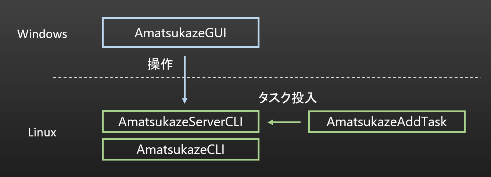

# Linux向けAmatsukazeServer

## 概要

AmatsukazeServerCLI と AmatsukazeCLI、AmatsukazeAddTask をLinux対応しました。ディレクトリ構造はWindowsとほぼ同等としています。

AmatsukazeGUI(操作ウィンドウ)は.NETのWPFが使われていますが、WPFはLinuxに対応していないようなので、Linux対応は難しいです。

そのため、LinuxでAmatsukazeServerCLIを起動して、WindowsからAmatsukazeGUIで接続する形になります。また、タスクのキューへの追加はAmatsukazeAddTaskの利用を想定しています。



## 想定動作環境

- x64のLinux環境
  
  とりあえずバイナリ配布はUbuntu 22.04、24.04 (x64)向けです。

## Linux対応状況

- Linux対応済み
  - AmatsukazeCLI
  - AmatsukazeServerCLI
  - AmatsukazeAddTask
  - ScriptCommand
  
  まだ対応しきれていない箇所がまだあるかもしれません…

- 未対応
  - ニコニコ実況コメント関連機能

    まったく詳しくないので、方法があれば教えてください...

- 対応予定なし
  - AmatsukazeGUI (操作ウィンドウ)
    - ロゴ解析含む
  - 設定画面へのドラッグドロップによるタスク追加
  - エンコード中の一時停止
  - エンコード後、スリープ・シャットダウン
  - SCRename によるリネーム機能
  - インタレ解除のうち、 D3DVPとAutoVfr
  - 音声エンコーダのうち、neroaacとqaac
  - 他のエンコーダの追加等

> [!NOTE]
> ロゴ生成もAmatsukazeGUI側の機能なので、これはWindows側で行う必要があります。生成したデータはServer(Linux)側に転送できるようにしています。

## インストール手順

### ビルドツールインストール

エンコーダやmuxer、CM解析ツールのビルドに使用します。

```bash
sudo apt update
sudo apt install -y build-essential git wget curl nasm cmake meson ninja-build pkg-config autoconf automake libtool
```

### 依存パッケージのインストール

AmatsukazeCLIの実行に必要です。

```bash
sudo apt install -y openssl zlib1g
```

### AviSynth+/AvisynthCUDAFiltersのインストール

[こちら](https://github.com/rigaya/AviSynthCUDAFilters/releases)から最新版のdebパッケージをダウンロードします。なお、自ビルドする場合は[こちら](https://github.com/rigaya/AviSynthCUDAFilters/blob/master/README_LINUX.md)を参考にしてください。

CUDAを使用する場合、CUDAを有効にしてビルドした下記AviSynth+をインストールする必要があります。
- avisynth_<version>_amd64_Ubuntuxx.xx.deb
- avisynthcudafilters_<version>_amd64_Ubuntuxx.xx.deb

```bash
sudo apt install -y ./avisynth_<version>_amd64_Ubuntuxx.xx.deb
sudo apt install -y ./avisynthcudafilters_<version>_amd64_Ubuntuxx.xx.deb
```

<details>
<summary>最新版をすべてコマンドでインストールする場合 (クリックで展開)</summary>

```bash
(curl -s https://api.github.com/repos/rigaya/AviSynthCUDAFilters/releases/latest \
  | grep "browser_download_url.*deb" | grep "avisynth_" | grep "Ubuntu24.04" | grep "amd64" | cut -d : -f 2,3 | tr -d \" \
  | wget -i - -O avisynth.deb \
  && sudo apt install -y ./avisynth.deb \
  && rm ./avisynth.deb)

(curl -s https://api.github.com/repos/rigaya/AviSynthCUDAFilters/releases/latest \
  | grep "browser_download_url.*deb" | grep "avisynthcudafilters_" | grep "Ubuntu24.04" | grep "amd64" | cut -d : -f 2,3 | tr -d \" \
  | wget -i - -O avisynthcudafilters.deb \
  && sudo apt install -y ./avisynthcudafilters.deb \
  && rm ./avisynthcudafilters.deb)
```
</details>

### その他必要なAvisynthプラグインのインストール

- yadif

  ```bash
  (git clone https://github.com/Asd-g/yadifmod2 \
    && cd yadifmod2 \
    && mkdir build && cd build && cmake .. \
    && make -j$(nproc) \
    && sudo make install)
  ```

- TIVTC

  ```bash
  (git clone https://github.com/pinterf/TIVTC \
    && cd TIVTC/src \
    && cmake -DCMAKE_EXPORT_COMPILE_COMMANDS=1 -B build -S . \
    && cmake --build build \
    && sudo make install)
  ```

- masktools

  ```bash
  (git clone https://github.com/pinterf/masktools.git \
    && cd masktools \
    && mkdir build && cd build && cmake .. \
    && make -j$(nproc) \
    && sudo make install)
  ```

- mvtools

  ```bash
  (git clone https://github.com/pinterf/mvtools.git \
    && cd mvtools \
    && mkdir build && cd build && cmake .. \
    && make -j$(nproc) \
    && sudo make install)
  ```

- RgTools

  ```bash
  (git clone https://github.com/pinterf/RgTools.git \
    && cd RgTools \
    && mkdir build && cd build && cmake .. \
    && make -j$(nproc) \
    && sudo make install)
  ```

### Amatsukazeのインストール

- Amatsukazeのアーカイブの展開

  ここではビルド済みアーカイブを展開してインストールする方法を示します。自ビルドする場合は[こちら](./BuildLinux.md)を参考にしてください。

  [こちら](https://github.com/rigaya/Amatsukaze/releases)からAmatsukazeのアーカイブをダウンロードして展開してください。
  **展開先は実行するユーザーが読み書きできる権限のあるディレクトリとしてください。** (下記では ```$HOME/Amatsukaze```)

  ```bash
  wget https://github.com/rigaya/Amatsukaze/releases/download/<version>/Amatsukaze_<version>_Ubuntuxx.xx.tar.xz
  tar xf Amatsukaze_<version>_Ubuntuxx.xx.tar.xz -C $HOME/Amatsukaze
  ```

- 各Avisynthプラグインへのリンクの作成

  ```./scripts/install.sh```を実行するとインストール済みの各Avisynthプラグインへのリンクが```exe_files/plugins64```に自動的に作成されます。

  ```bash
  cd $HOME/Amatsukaze
  ./scripts/install.sh
  ```

### 必要な実行ファイルのインストール

- エンコーダ

  - x264, x265, svt-av1
  
    ```bash
    sudo apt install -y x264 x265 svt-av1
    ```
  
  - qsvencc, nvencc, vceencc
  
    hwエンコードを使用する場合、qsvencc (Intel GPU), nvencc (NVIDIA GPU), vceencc (AMD GPU)を使用します。
  
    - ドライバも含めたインストール方法は下記リンク先を参照してください。
      - [qsvencc](https://github.com/rigaya/QSVEnc/blob/master/Install.ja.md)
      - [nvencc](https://github.com/rigaya/NVEnc/blob/master/Install.ja.md)
      - [vceencc](https://github.com/rigaya/VCEEnc/blob/master/Install.ja.md)
  
    <details>
    <summary>最新版をすべてコマンドでインストールする場合 (クリックで展開)</summary>

    Ubuntu24.04 のところは対象OSにあわせて適宜置き換えてください。
    ```bash
    # qsvencc
    (curl -s https://api.github.com/repos/rigaya/QSVEnc/releases/latest \
      | grep "browser_download_url.*deb" | grep "Ubuntu24.04" | grep "amd64" | cut -d : -f 2,3 | tr -d \" \
      | wget -i - -O qsvencc.deb \
      && sudo apt install -y ./qsvencc.deb \
      && rm ./qsvencc.deb)
    
    # nvencc
    (curl -s https://api.github.com/repos/rigaya/NVEnc/releases/latest \
      | grep "browser_download_url.*deb" | grep "Ubuntu24.04" | grep "amd64" | cut -d : -f 2,3 | tr -d \" \
      | wget -i - -O nvencc.deb \
      && sudo apt install -y ./nvencc.deb \
      && rm ./nvencc.deb)
    
    # vceencc
    (curl -s https://api.github.com/repos/rigaya/VCEEnc/releases/latest \
      | grep "browser_download_url.*deb" | grep "Ubuntu24.04" | grep "amd64" | cut -d : -f 2,3 | tr -d \" \
      | wget -i - -O vceencc.deb \
      && sudo apt install -y ./vceencc.deb \
      && rm ./vceencc.deb)
    ```
    </details>

- muxer

  - mp4box
  
    ```bash
    (git clone https://github.com/gpac/gpac.git \
      && cd gpac \
      && ./configure --static-bin \
      && make -j$(nproc) \
      && sudo make install)
    ```
  
  - mkvmerge
  
    ```bash
    sudo apt install mkvtoolnix
    ```
  
  - L-SMASH (muxer, timelineeditor)
  
    ```bash
    (git clone https://github.com/l-smash/l-smash.git \
      && cd l-smash \
      && ./configure \
      && make -j$(nproc) \
      && sudo make install)
    ```

  - tsreplace
  
    [こちら](https://github.com/rigaya/tsreplace/releases)から最新版をダウンロードしてインストールします。

    ```bash
    sudo apt install -y ./tsreplace_<version>_amd64_Ubuntuxx.xx.deb
    ```
  
    <details>
    <summary>最新版をすべてコマンドでインストールする場合 (クリックで展開)</summary>

    ```bash
    (curl -s https://api.github.com/repos/rigaya/tsreplace/releases/latest \
      | grep "browser_download_url.*deb" | grep "Ubuntu24.04" | grep "amd64" | cut -d : -f 2,3 | tr -d \" \
      | wget -i - -O tsreplace.deb \
      && sudo apt install -y ./tsreplace.deb \
      && rm ./tsreplace.deb)
    ```
    </details>

- CM/ロゴ解析等

  - chapter_exe
  
    ```bash
    (git clone https://github.com/rigaya/chapter_exe \
      && cd chapter_exe/src \
      && make -j$(nproc) \
      && sudo install -D -t /usr/local/bin chapter_exe)
    ```
  
  - join_logo_scp
  
    ```bash
    (git clone https://github.com/tobitti0/join_logo_scp \
      && cd join_logo_scp/src \
      && make -j$(nproc) \
      && sudo install -D -t /usr/local/bin join_logo_scp)
    ```

- 音声エンコーダ

  - fdkaac
  
    ```bash
    (git clone https://github.com/mstorsjo/fdk-aac.git \
      && cd fdk-aac \
      && ./autogen.sh \
      && ./configure --disable-shared --prefix=$(pwd)/fdk-aac-libs \
      && make -j$(nproc) \
      && make install \
      && cd .. \
      && git clone https://github.com/nu774/fdkaac.git \
      && cd fdkaac \
      && autoreconf -i \
      && PKG_CONFIG_PATH=../fdk-aac/fdk-aac-libs/lib/pkgconfig ./configure \
      && make -j$(nproc) \
      && sudo make install)
    ```
  
  - opusenc
  
    ```bash
    sudo apt install -y opus-tools
    ```

## 実行方法

ここでは```$HOME/Amatsukaze```にインストールしたものとして記述しています。

### Linuxでのサーバー(AmatsukazeServerCLI)の起動

下記のように実行します。

```bash
cd $HOME/Amatsukaze
./AmatsukazeServer.sh
```


サーバーが開始されたと出ればOKです。

### Windowsからの接続

その後、Windowsから ```AmatsukazeClient.vbs``` を実行して接続します。

下記画面が表示されたら、```ifconfig```コマンド等で確認できるサーバー側のIPアドレスを入力し、「OK」をクリックします。


その後、設定画面左下の「更新」をクリックすると、サーバー情報でウィンドウが更新されます。


初回接続時は基本設定を行ってください。実行ファイルのパスに関しては、exe_files以下、あるいは PATH に含まれる実行ファイルは、右下「適用」ボタンをクリックすると自動で入力されます。 PATH に含まれる実行ファイルは、ファイル名のみの記述で構いません。


### タスクの追加

タスクの追加はLinux側で、AmatsukazeAddTask を使って行います。

```bash
cd $HOME/Amatsukaze
./exe_files/AmatsukazeAddTask -f <対象ファイル名> -o <出力フォルダ> -s <プロファイル名>
```

プロファイル名は、設定画面のプロファイルタブの使用したいプロファイル名を指定します。


