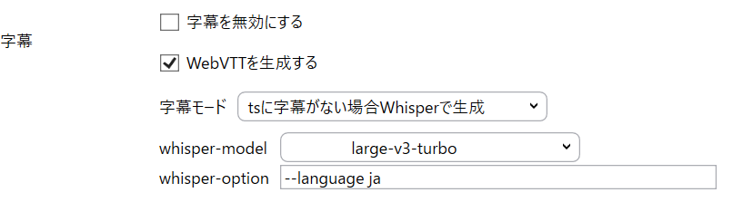
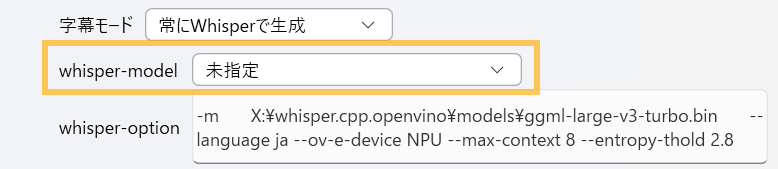

# 字幕生成

Amatsukazeでは、Whisperを使用した音声からの字幕生成が可能です。

字幕モードで「Whisperで生成」を選択することで、音声から文字起こしによりSRT字幕を生成することができます。

Amatsukazeでは、faster-whisperをベースとする[whisper-standalone-win](https://github.com/Purfview/whisper-standalone-win)と[whisper.cpp](https://github.com/ggml-org/whisper.cpp)に対応しています。

導入の容易さと精度の観点で、[whisper-standalone-win](https://github.com/Purfview/whisper-standalone-win)を推奨しますが、[whisper-standalone-win](https://github.com/Purfview/whisper-standalone-win)はNVIDIA GPUとCPUのみに対応しています。

CPUでの字幕生成は時間を要するため、NVIDIA GPUのない環境で、Intel/AMD GPUやIntel NPUを使用したい場合には、[whisper.cpp](https://github.com/ggml-org/whisper.cpp)を試してみてください(ただし、導入難易度は高めです)。

---
## whisper-standalone-win (faster-whisperの実装)

[whisper-standalone-win](https://github.com/Purfview/whisper-standalone-win)からFaster-Whisper-XXLをダウンロードし、適当な場所に展開します。




### Amatsukazeでの設定方法

[基本設定]タブで展開した場所にあるfaster-whisper-xxlのパスを指定してください。

その後、プロファイルの[字幕モード]でWhisperで字幕を生成するよう指定してください。

faster-whisperの場合、whisper-optionは特に指定しなくてもまずは問題なく動作します。

なお、初回実行時にはモデルのダウンロードが行われるため、時間がかかります。

---
## whisper.cpp

whisper.cppを使用する場合は、実行ファイルのビルド・モデルの準備等を自分で行う必要があります。

### ビルド

Intel GPU/NPUを使用する場合と、AMD GPUを使用する場合で、ビルド方法が異なります。

**前提**
下記は導入済みとします。

- Visual Studio 2022 (Windows) / gcc,g++ (Linux)
- cmake

#### Intel GPU / Intel NPU向けにビルドする

whisper.cppの[OpenVINO実装](https://github.com/ggml-org/whisper.cpp#openvino-support)を使用します。

[OpenVINO](https://storage.openvinotoolkit.org/repositories/openvino/packages/)をダウンロードして、適当な場所に展開します。

また、Intel TBBが必要になるため、[OneAPI](https://www.intel.com/content/www/us/en/developer/tools/oneapi/base-toolkit-download.html)をダウンロードしてインストールします。

Windowsでは、"Intel oneAPI command prompt for Intel 64 for Visual Studio 2022" を開きます。

```-DAVX512_FOUND```は使用する環境に合わせて指定してください。AVX512有効でビルドをしてしまうとAVX512非対応の環境で異常終了してしまうためです。

```bat
<OpenVINOの展開先>\setupvars.bat

# whisper.cppをOpenVINO有効でビルド
git clone https://github.com/ggml-org/whisper.cpp.git
cd whisper.cpp
cmake -B build -DCMAKE_CXX_FLAGS_RELEASE="/MT /Ox /Ob2 /DNDEBUG" -DWHISPER_OPENVINO=1 -DAVX512_FOUND=[ON,OFF]
cmake --build build -j --config Release
```

```build\bin\Release```に実行ファイルが生成されます。

このディレクトリに下記dllをコピーします。

- OpenVINO関連のdll
  ```<OpenVINOの展開先>\runtime\bin\intel64\Release\openvino*.dll```すべて
  
- TBB関連のdll
  ```C:\Program Files (x86)\Intel\oneAPI\tbb\latest\bin\tbb*.dll```すべて

#### AMD GPU向けにビルドする

whisper.cppの[Vulkan実装](https://github.com/ggml-org/whisper.cpp#vulkan-gpu-support)を使用します。

[Vulkan SDK](https://vulkan.lunarg.com/sdk/home)をインストールします。インストールするコンポーネントはデフォルトで構いません。

Windowsでは、"x64 Native Tools Command Prompt for VS 2022"を開き、下記のようにビルドします。

```-DAVX512_FOUND```は使用する環境に合わせて指定してください。AVX512有効でビルドをしてしまうとAVX512非対応の環境で異常終了してしまうためです。

```bat
# whisper.cppをVulkan有効でビルド
git clone https://github.com/ggml-org/whisper.cpp.git
cd whisper.cpp
cmake -B build -DCMAKE_CXX_FLAGS_RELEASE="/MT /Ox /Ob2 /DNDEBUG" -DGGML_VULKAN=1 -DAVX512_FOUND=[ON,OFF]
cmake --build build -j --config Release
```

```build\bin\Release```に実行ファイルが生成されます。

### モデルのダウンロード

事前にモデルのダウンロードを行います。下記では、```large-v3-turbo```の例を示しますが、利用するモデルに応じて適宜読み替えてください。

```bat
cd models
download-ggml-model.cmd large-v3-turbo
```

```ggml-large-v3-turbo.bin``` がダウンロードされます。

Intel GPU / Intel NPUを使用する場合は、さらに追加で下記操作が必要です。

```bat
cd models
python -m venv openvino_conv_env
openvino_conv_env\Scripts\activate
python -m pip install --upgrade pip
pip install -r requirements-openvino.txt
pip install onnxscript
python convert-whisper-to-openvino.py --model large-v3-turbo
```

```ggml-large-v3-turbo-encoder-openvino.[bin/xml]```が生成されます。

### Amatsukazeでの設定方法

[基本設定]タブでビルドした```whisper-cli```のパスを指定してください。

また、プロファイル設定では、[字幕モード]でWhisperで字幕を生成するよう指定してください。



[whisper-model]は**未指定**を選択してください。(この設定欄はfaster-whisper用です)

[whisper-option]は、whisper.cppの場合、下記を**ベースに**調整してみてください。

```-m <使用するモデルへのパス> --language ja --split-on-word --entropy-thold 2.8 --max-context 8```

- -m <使用するモデルへのパス>
  
  使用するモデルへのパスは、例えば```ggml-large-v3-turbo.bin```へのフルパスとしてください。

- --language ja
  
  whisper.cppはデフォルトが英語なので、指定が必要です。自動判定したいときは、```--language auto```とします。

- --split-on-word --entropy-thold 2.8 --max-context 8
  
  whisper.cppはfaster-whisperと異なり、音楽等認識が安定しないときに繰り返し同じ文字列を返す傾向があり、それを抑制するオプションです。

また、OpenVINOビルドでは、下記指定が追加で必要です。

- Intel GPUを使用する場合
  
  ```--ov-e-device GPU```

- Intel NPUを使用する場合

  ```--ov-e-device NPU```