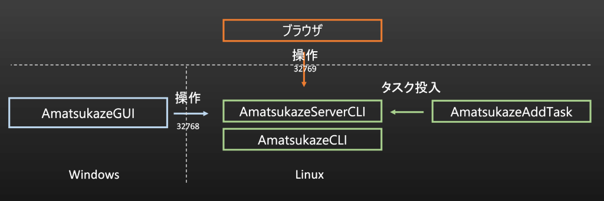
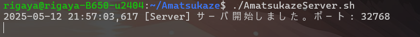
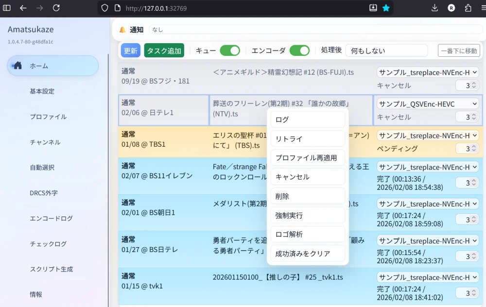
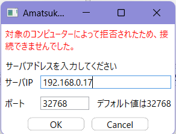
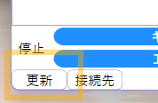
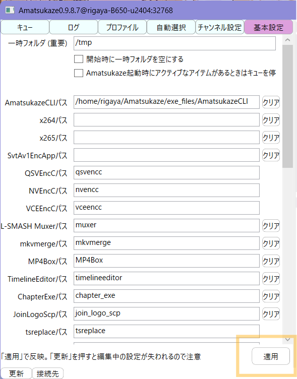
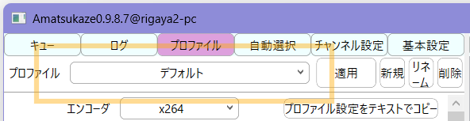

# Linux向けAmatsukazeServer

## 概要

AmatsukazeServerCLI と AmatsukazeCLI、AmatsukazeAddTask に加えて、WebUI (ブラウザUI) をLinuxで利用できます。ディレクトリ構造はWindowsとほぼ同等としています。

AmatsukazeGUI(操作ウィンドウ)は.NETのWPFが使われているため、Linuxでは利用できません。

Linuxでは、AmatsukazeServerCLIを起動し、WebUI (`http://<サーバーIP>:32769/` 既定) から操作する構成を推奨します。Windowsクライアントからの接続も引き続き利用できます。タスクのキューへの追加はAmatsukazeAddTaskの利用を想定しています。



## 想定動作環境

- 配布アーカイブを直接実行する場合

  x86_64のglibc系Linux環境（glibc 2.31以降）

  glibcのバージョンから見た下限は、

  - Ubuntu 20.04
  - Debian 11
  - AlmaLinux／Rocky Linux 9
  - Fedora 32
  - openSUSE Leap 15.3
  
  などです。各ディストリビューションのサポート期間内にあるバージョンを使用してください。glibcのバージョンは`ldd --version`で確認できます。

  dockerでも利用できます。

## Linux対応状況

- Linux対応済み
  - AmatsukazeCLI
  - AmatsukazeServerCLI
  - AmatsukazeAddTask
  - AmatsukazeWebUI
  - ScriptCommand

  まだ対応しきれていない箇所がまだあるかもしれません…

- 代替実装あり

  完全互換ではありませんが、代替実装を用意しています。

  - AmatsukazeGUI -> WebUI
  - ニコニコ実況関連 -> nicojk_ass.py + [danmaku2ass.py](https://github.com/m13253/danmaku2ass)

- 対応予定なし
  - 設定画面へのドラッグドロップによるタスク追加
  - 常時表示ディスク
  - エンコード中の一時停止
  - エンコード後、スリープ・シャットダウン
  - インタレ解除のうち、 D3DVPとAutoVfr
  - 音声エンコーダのうち、neroaacとqaac
  - 他のエンコーダの追加等

> [!NOTE]
> ロゴ解析/生成はWebUIからも実行できます。従来どおりWindows側のAmatsukazeGUIから実行することも可能です。

## インストール手順 (docker)

dockerでのインストール方法は[こちら](../docker/readme.md)。

## インストール手順 (通常)

ここでは、配布アーカイブを使用してインストールします。

AviSynth、フィルタ、ソフトウェアエンコーダ、muxer、字幕ツールなどは同梱されているので、展開するだけで使用できます。

追加でpython3.7以降が必要ですので、例えばUbuntu／Debianでは下記の通りインストールしてください。

```bash
sudo apt install python3
```

[リリース一覧](https://github.com/rigaya/Amatsukaze/releases)からLinux x64向けアーカイブをダウンロードし、実行するユーザーが読み書きできる場所に展開します。ダウンロードしたアーカイブが現在のディレクトリにある場合の例です。

```bash
mkdir -p "$HOME/Amatsukaze"
tar -xf ./Amatsukaze_linux_*.tar.xz -C "$HOME/Amatsukaze"
```

自分で本体や依存モジュールをビルドする場合は[BuildLinux.md](./BuildLinux.md)を参照してください。

### HWエンコーダの導入

- qsvencc, nvencc, vceencc

  hwエンコードを使用する場合、qsvencc (Intel GPU), nvencc (NVIDIA GPU), vceencc (AMD GPU)を使用します。

  - ドライバも含めたインストール方法は下記リンク先を参照してください。
    - [qsvencc](https://github.com/rigaya/QSVEnc/blob/master/Install.ja.md)
    - [nvencc](https://github.com/rigaya/NVEnc/blob/master/Install.ja.md)
    - [vceencc](https://github.com/rigaya/VCEEnc/blob/master/Install.ja.md)

  <details>
  <summary>最新版をすべてコマンドでインストールする場合 (クリックで展開)</summary>

  ```bash
  # qsvencc
  (curl -s https://api.github.com/repos/rigaya/QSVEnc/releases/latest \
    | grep "browser_download_url.*deb" | grep "amd64" | cut -d : -f 2,3 | tr -d \" \
    | wget -i - -O qsvencc.deb \
    && sudo apt install -y ./qsvencc.deb \
    && rm ./qsvencc.deb)

  # nvencc
  (curl -s https://api.github.com/repos/rigaya/NVEnc/releases/latest \
    | grep "browser_download_url.*deb" | grep "amd64" | cut -d : -f 2,3 | tr -d \" \
    | wget -i - -O nvencc.deb \
    && sudo apt install -y ./nvencc.deb \
    && rm ./nvencc.deb)

  # vceencc
  (curl -s https://api.github.com/repos/rigaya/VCEEnc/releases/latest \
    | grep "browser_download_url.*deb" | grep "amd64" | cut -d : -f 2,3 | tr -d \" \
    | wget -i - -O vceencc.deb \
    && sudo apt install -y ./vceencc.deb \
    && rm ./vceencc.deb)
  ```
  </details>

## 実行方法

ここでは```$HOME/Amatsukaze```にインストールしたものとして記述しています。

### Linuxでのサーバー(AmatsukazeServerCLI)の起動

下記のように実行します。

```bash
cd $HOME/Amatsukaze
./AmatsukazeServer.sh
```



サーバーが開始されたと出ればOKです。

### サーバーへの接続

サーバーへの接続は、WebUIからと、WindowsのAmatsukazeClient、どちらからでも接続できます。

#### WebUIからの接続

ブラウザから下記URLを開いて接続します。

- `http://<サーバーIP>:32769/`

`32769` は既定値です。

`AmatsukazeServerCLI` を `-p <port>` で起動している場合は `http://<サーバーIP>:<port+1>/` を使用してください。



#### Windowsからの接続 (AmatsukazeClient)

その後、Windowsから ```AmatsukazeClient.bat``` を実行して接続します。

下記画面が表示されたら、```ifconfig```コマンド等で確認できるサーバー側のIPアドレスを入力し、「OK」をクリックします。



その後、設定画面左下の「更新」をクリックすると、サーバー情報でウィンドウが更新されます。



初回接続時は基本設定を行ってください。実行ファイルのパスに関しては、exe_files以下、あるいは PATH に含まれる実行ファイルは、右下「適用」ボタンをクリックすると自動で入力されます。 PATH に含まれる実行ファイルは、ファイル名のみの記述で構いません。



### タスクの追加

タスクの追加はLinux側で、AmatsukazeAddTask を使って行います。

```bash
cd $HOME/Amatsukaze
./exe_files/AmatsukazeAddTask -f <対象ファイル名> -o <出力フォルダ> -s <プロファイル名>
```

プロファイル名は、設定画面のプロファイルタブの使用したいプロファイル名を指定します。


