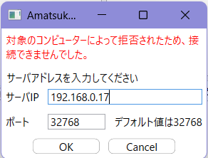
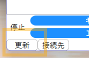
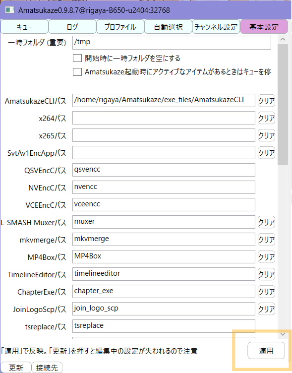

# Dockerでの利用方法

## 事前準備

### dockerのインストール

```sh
# dockerのインストール
sudo apt-get update
sudo apt-get install ca-certificates curl
sudo install -m 0755 -d /etc/apt/keyrings
sudo curl -fsSL https://download.docker.com/linux/ubuntu/gpg -o /etc/apt/keyrings/docker.asc
sudo chmod a+r /etc/apt/keyrings/docker.asc

echo \
  "deb [arch=$(dpkg --print-architecture) signed-by=/etc/apt/keyrings/docker.asc] https://download.docker.com/linux/ubuntu \
  $(. /etc/os-release && echo "${UBUNTU_CODENAME:-$VERSION_CODENAME}") stable" | \
  sudo tee /etc/apt/sources.list.d/docker.list > /dev/null
sudo apt-get update

sudo apt-get install docker-ce docker-ce-cli containerd.io docker-buildx-plugin docker-compose-plugin

sudo usermod -a -G docker $USER
```

### NVIDIA Driverのインストール

AmatsukazeでCUDA、NVEncを使用する場合に必要

```sh
# インストール可能なものを確認
rigaya@rigaya8-u2404:~$ ubuntu-drivers devices
== /sys/devices/pci0000:00/0000:00:01.0/0000:01:00.0 ==
modalias : pci:v000010DEd00001B80sv000019DAsd00001426bc03sc00i00
vendor   : NVIDIA Corporation
model    : GP104 [GeForce GTX 1080]
driver   : nvidia-driver-570-server - distro non-free
driver   : nvidia-driver-470 - distro non-free
driver   : nvidia-driver-535 - distro non-free
driver   : nvidia-driver-580 - distro non-free
driver   : nvidia-driver-580-server - distro non-free
driver   : nvidia-driver-570 - distro non-free
driver   : nvidia-driver-535-server - distro non-free
driver   : nvidia-driver-550 - distro non-free recommended
driver   : nvidia-driver-470-server - distro non-free
driver   : xserver-xorg-video-nouveau - distro free builtin

# 最新版をインストール
rigaya@rigaya8-u2404:~$ sudo apt install nvidia-driver-580
```

### NVIDIA Container Toolkit のインストール

AmatsukazeでCUDA、NVEncを使用する場合に必要 (使用しない場合は不要)

バージョンは[公式ページ](https://docs.nvidia.com/datacenter/cloud-native/container-toolkit/latest/install-guide.html)に沿って変更したほうが良いかも

```sh
curl -fsSL https://nvidia.github.io/libnvidia-container/gpgkey | sudo gpg --dearmor -o /usr/share/keyrings/nvidia-container-toolkit-keyring.gpg \
  && curl -s -L https://nvidia.github.io/libnvidia-container/stable/deb/nvidia-container-toolkit.list | \
    sed 's#deb https://#deb [signed-by=/usr/share/keyrings/nvidia-container-toolkit-keyring.gpg] https://#g' | \
    sudo tee /etc/apt/sources.list.d/nvidia-container-toolkit.list
sudo apt-get update

export NVIDIA_CONTAINER_TOOLKIT_VERSION=1.17.8-1
sudo apt-get install -y \
      nvidia-container-toolkit=${NVIDIA_CONTAINER_TOOLKIT_VERSION} \
      nvidia-container-toolkit-base=${NVIDIA_CONTAINER_TOOLKIT_VERSION} \
      libnvidia-container-tools=${NVIDIA_CONTAINER_TOOLKIT_VERSION} \
      libnvidia-container1=${NVIDIA_CONTAINER_TOOLKIT_VERSION}
# dockerを再起動
sudo systemctl restart docker
```

### Intel Driverのインストール

AmatsukazeでQSVを使用する場合に必要 (QSVを使用しない場合は不要)

```sh
sudo apt-get install -y gpg-agent wget
wget -qO - https://repositories.intel.com/gpu/intel-graphics.key | sudo gpg --yes --dearmor --output /usr/share/keyrings/intel-graphics.gpg
echo "deb [arch=amd64,i386 signed-by=/usr/share/keyrings/intel-graphics.gpg] https://repositories.intel.com/gpu/ubuntu noble unified" | \
  sudo tee /etc/apt/sources.list.d/intel-gpu-noble.list
sudo apt update
sudo apt install intel-media-va-driver-non-free intel-opencl-icd libmfx1 libmfx-gen1.2 libva-drm2 libva-x11-2 libigfxcmrt7
```

### AmatsukazeAddTaskの準備

コンテナ外で唯一必要になるAmatsukazeAddTaskを(コンテナ外に)準備します。

```sh
  UBUNTU_VERSION=24.04
  # /usr/local/bin/にインストールする例
  mkdir -p /tmp/Amatsukaze \
    && curl -s https://api.github.com/repos/rigaya/Amatsukaze/releases/latest \
        | grep "browser_download_url.*tar.xz" | grep "Ubuntu${UBUNTU_VERSION}" | cut -d : -f 2,3 | tr -d \" \
        | wget -i - -O - | tar -xJ -C /tmp/Amatsukaze \
    && sudo install /tmp/Amatsukaze/exe_files/AmatsukazeAddTask /usr/local/bin/ \
    && rm -rf /tmp/Amatsukaze
```

## コンテナ作成用のディレクトリ構築

```sh
git clone https://github.com/rigaya/Amatsukaze.git
cd Amatsukaze/docker
# ディレクトリ構成の作成
./setup.sh
# Amatsukazeを実行するユーザーIDとグループIDをRUN_UIDとRUN_GIDで指定
# 必要に応じて volumes のマウント対象等を調整
# また、環境に応じて devices や deploy を調整
vi compose.yml
```

## 起動

```sh
docker compose up -d
```

## Windowsからの接続

Windowsから ```AmatsukazeClient.bat``` を実行して接続します。

下記画面が表示されたら、```ipconfig```コマンド等で確認できるサーバー側のIPアドレスを入力し、「OK」をクリックします。



その後、設定画面左下の「更新」をクリックすると、サーバー情報でウィンドウが更新されます。



初回接続時は基本設定を行ってください。実行ファイルのパスに関しては、exe_files以下、あるいは PATH に含まれる実行ファイルは、右下「適用」ボタンをクリックすると自動で入力されます。 PATH に含まれる実行ファイルは、ファイル名のみの記述で構いません。



## タスクの追加

```AmatsukazeAddTask```でタスク追加を行います。このとき、```-o``` と ```-f``` は、docker内からどう見えているかを考慮してパスを置き換える必要があります。

入力ファイルを ```./input``` に置いたとき、下記のようにタスク追加すると ```./output``` に出力されます。

```sh
#  (コンテナ外) ./input  -> (コンテナ内) /app/input
#  (コンテナ外) ./output -> (コンテナ内) /app/output
AmatsukazeAddTask -ip <コンテナを実行中のPCのIPアドレス> -s <プロファイル名> -o /app/output -f /app/input/<入力tsファイル名>
```

## 設定

デフォルトの設定は下記のとおりです。必要に応じて```compose.yml```を編集して変更してください。

| | ポート |
|:--|:--:|
| Amastuakze | 32768 |

| | コンテナ外 | コンテナ内 |
|:--|:--|:--|
| 入力tsデータ用          | ```./input```   | ```./app/input```   |
| エンコード結果データ用  | ```./output```  | ```./app/output```  |
| Amatsuakze avsファイル  | ```./avs```     | ```./app/avs```     |
| Amatsuakze batファイル  | ```./bat```     | ```./app/bat```     |
| Amatsuakze 設定ファイル | ```./config```  | ```./app/config```  |
| Amatsuakze drcs外字     | ```./drcs```    | ```./app/drcs```    |
| Amatsuakze JLファイル   | ```./JL```      | ```./app/JL```      |
| Amatsuakze ロゴデータ   | ```./logo```    | ```./app/logo```    |
| Amatsuakze プロファイル | ```./profile``` | ```./app/profile``` |

## 停止

```sh
docker compose down
```

## 更新

```sh
# 更新
docker compose pull
docker compose build --pull
# 最新のイメージを元に起動
docker compose up -d
```